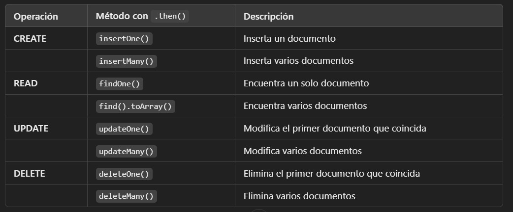

# METHODS MONGO
## METHODS CRUD




## INSERT METHODS
### insertOne()
```sh
db.collection("usuarios").insertOne({ nombre: "Arnau", edad: 26 })
  .then(resultado => console.log("Documento insertado:", resultado))
  .catch(error => console.error("Error al insertar:", error));

  Inserts a single document into a collection.

```
### insertMany()
```sh
db.collection("usuarios").insertMany([{ nombre: "María", edad: 30 }, { nombre: "Carlos", edad: 25 }])
  .then(resultado => console.log("Documentos insertados:", resultado.insertedCount))
  .catch(error => console.error("Error al insertar:", error));

  Inserts multiple documents into a collection.

```
## DELETE METHODS
### deleteOne()
```sh
db.collection("usuarios").deleteOne({ nombre: "Arnau" })
  .then(resultado => console.log("Documentos eliminados:", resultado.deletedCount))
  .catch(error => console.error("Error al eliminar:", error));

  deletedCount indica cuántos documentos fueron eliminados
```
### deleteMany()
```sh
db.collection("usuarios")
  .deleteMany({ edad: { $gt: 30 } }) // Elimina usuarios con edad mayor a 30
  .then(resultado => console.log("Documentos eliminados:", resultado.deletedCount))
  .catch(error => console.error("Error al eliminar:", error));
```
## UPDATE METHODS
### updateOne() 
 ```sh
 db.collection("usuarios")
  .updateOne({ nombre: "Arnau" }, { $set: { edad: 27 } })
  .then(resultado => console.log("Documentos modificados:", resultado.modifiedCount))
  .catch(error => console.error("Error al actualizar:", error));

 Updates a single document within the collection based on the filter.
 when used with the upsert: true option.
 ```
### updateMany()
```sh
db.collection("usuarios")
  .updateMany({ edad: { $lt: 30 } }, { $inc: { edad: 1 } }) // Suma 1 a la edad de todos los menores de 30
  .then(resultado => console.log("Documentos modificados:", resultado.modifiedCount))
  .catch(error => console.error("Error al actualizar:", error));

Updates all documents that match the specified filter for a collection.
when used with the upsert: true option.
```
## FIND METHODS
### findOne()
```sh
db.collection("usuarios").findOne({ nombre: "Arnau" })
  .then(usuario => console.log("Usuario encontrado:", usuario))
  .catch(error => console.error("Error al buscar:", error));

  If user doesn't exits, return a null.
```
### find()
```sh
db.collection("usuarios").find({ edad: { $gte: 25 } }) // Busca usuarios con edad mayor o igual a 25
  .toArray()
  .then(usuarios => console.log("Usuarios encontrados:", usuarios))
  .catch(error => console.error("Error al buscar:", error));
  If user doesn't exits, return a null.

   toArray() es necesario porque find() devuelve un cursor, no un array directamente.
```
### findAndModify()
```sh
Updates and returns a single document. By default, the returned document does not include the modifications made on the update. 
To return the document with the modifications made on the update, use the new option.
when used with the upsert: true option.
```
### findOneAndUpdate()
```sh

when used with the upsert: true option.
```
### findOneAndReplace() 
```sh
when used with the upsert: true option.
```
### bulkWrite().
```sh
Performs multiple write operations with controls for order of execution.
```

# ---- PARA LEVANTAR MONGO ---
```sh
(levantar mongo db) => cd D:\MONGODB\mongodb-win32-x86_64-windows-8.0.5  =>  (ruta donde tienes tu carpeta mongodb)
bin\mongod.exe --dbpath data  => comando a ejecutar en terminal 1 

(levantar mongosh) => cd D:\MONGODB\mongosh-2.4.2-win32-x64  =>  (ruta donde tienes tu carpeta mongosh)
bin\mongosh   => comando a ejecutar en terminal 2
```