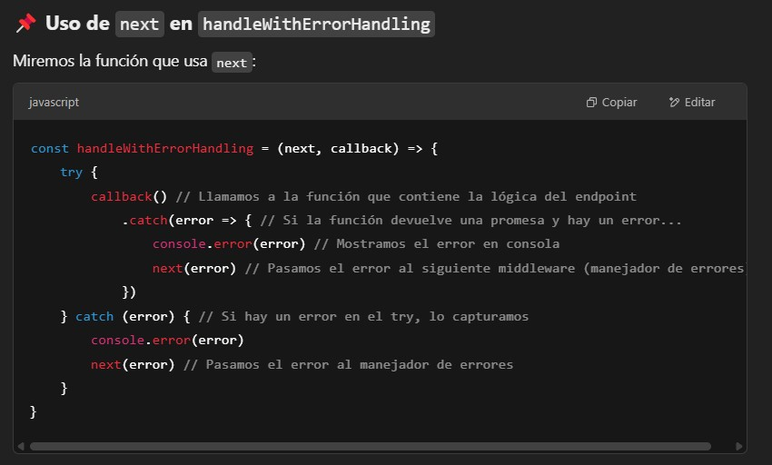
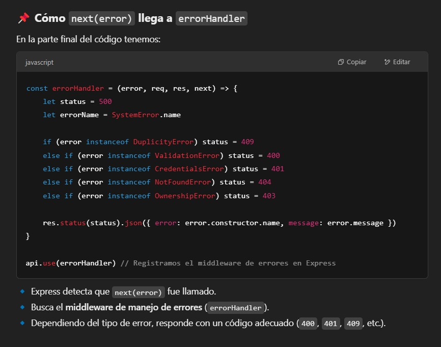
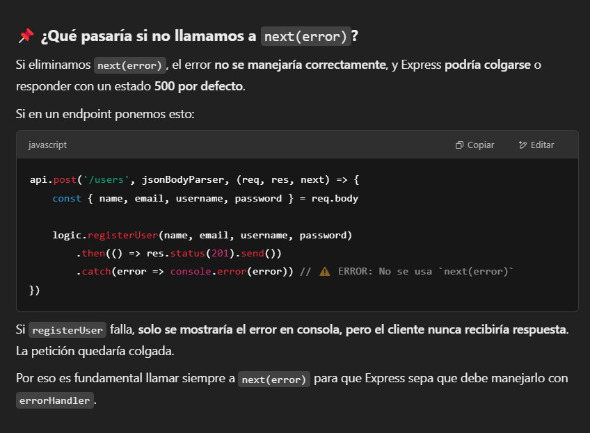
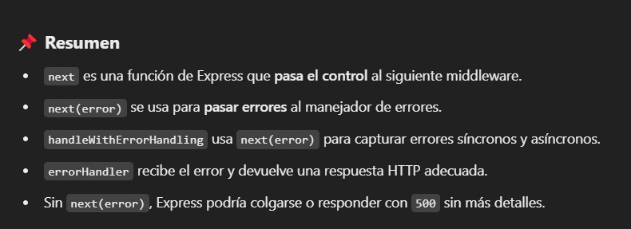

```sh
🔹 Flujo normal:

Se ejecuta callback(), que es la lógica del endpoint (por ejemplo, logic.registerUser(...)).

Si no hay errores, el código sigue su ejecución normal y responde con res.status(...).send().

🔹 Si ocurre un error asíncrono (por ejemplo, una promesa rechazada):

La promesa entra en el .catch(error => { ... }).

next(error) se llama con el error.

Express detecta que se llamó a next(error) y envía el error al manejador de errores (errorHandler).

🔹 Si ocurre un error síncrono (por ejemplo, una excepción en try):

El catch (error) { ... } captura el error.

next(error) se llama.

Express lo pasa al manejador de errores.
```



