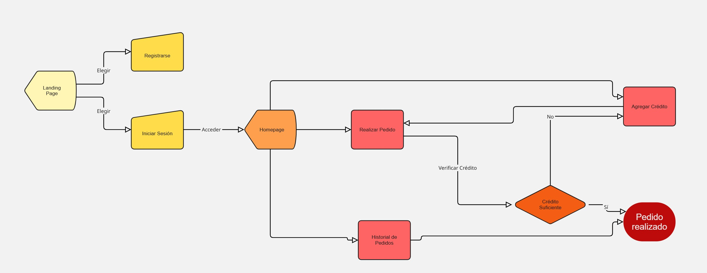

# Little breakfast

## Intro

Little breakfast es una aplicación móvil dirigida a familias que desean un servicio de desayuno diario para sus hijos de primaria en el colegio.
En muchas familias, las mañanas son ajetreadas y puede ser un reto diario preparar el desayuno para sus hijos. Little breakfast pretende solucionar este problema ofreciendo una forma sencilla y fiable de garantizar un desayuno nutritivo y elaborado diariamiente para los niños.
Las familias pueden gestionar y controlar qué tipo de desayuno reciben sus hijos y realizar los pedidos desde la app de manera fácil, rápida y económica.

## Functional

### Use Cases

#### Customer(Parents)

- See menu options
- Place orders
- Cancel order
- See credit
- Add credit 
- View order historial
- View generated invoices(planned)

#### Provider (planned)

- Manage menus
- View and manage orders
- View and manage invoices (planned)

*Diagrama de flujo del proceso de pedidos, desde que el padre realiza el pedido hasta que el niño recibe el desayuno.

### UIUX Design

[Figma](https://www.figma.com/design/F7M3yyebkzAE9AtGNZjbet/Untitled?node-id=0-1&p=f&t=5AmLdpNJArPguNHN-0)

## Technical

### Blocks

- App (frontend)
- Api (backend)
- DB (data bases)

### Packages

- app (client-side application)
- api (...)
- com(validations, errors)
- doc (documentation)

### UI Components (arquitectura de componentes)

(diagrama de componentes por ejemplo)
 (no obligatorio)

### Behaviors

### Data Model

User
- id (string, uuid)
- role(string, enum: customer | provider)
- name (string, minLength 1, maxLength 50)
- email (string, email)
- password(string)
- createdAt (Date)
- modifiedAt (Date)

Menu

- id(string, uuid)
- ordinal (number)
- name (string)
- description (string)
- allergens (array of strings)
- categories (array of strings: regular | veggie | vegan | halal )
- breadOptions (array of strings: gluten | gluten free | whole wheat)
- price (number)

Order

- id(string, uuid, identificador único para el pedido)
- user (User.id)
- menu (Menu.id)
- bread (string)
- note (String, name of child and school)
- status (string, estado del pedido: pendiente|en camino|entregado|cancelado)
- deliveryDate(Date, fecha de entrega)
- createdAt (Date, fecha realización pedido)
- modifiedAt(Date, fecha ultima modificación)

### Technologies

- Frontend: Vite, HTML, CSS, JavaScript, React, Tailwind CSS
- Backend: Node.js, Express, MongoDB
- Authentication: JSON Web Tokens

## Planning 
(planing del proyecto, que esta en la issue, copiamos el link)

[Issue Tracking] https://github.com/b00tc4mp/isdi-bootcamp-202501/issues/76

### Code Coverage
Testings

