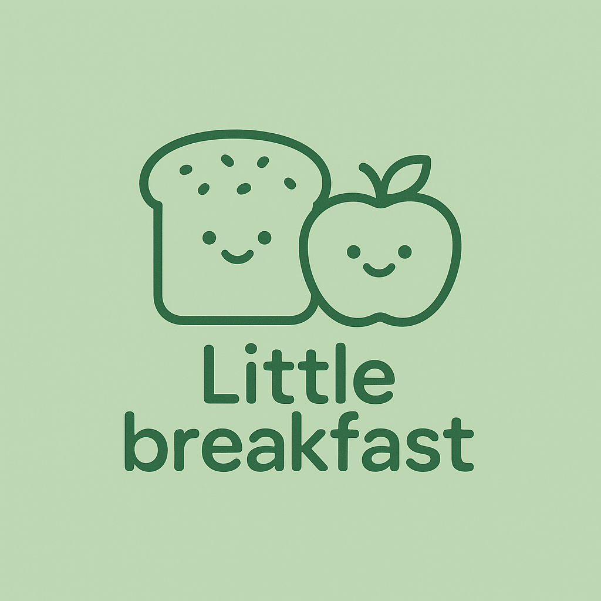
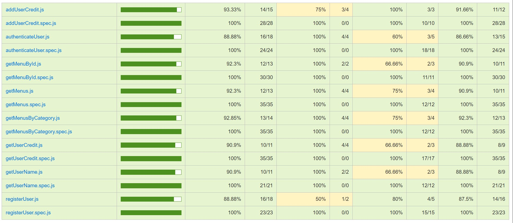

# Little breakfast

## Intro

Little Breakfast is a mobile app aimed at families who want a daily breakfast service for their elementary school children.
For many families, mornings are busy, and preparing breakfast for their children can be a daily challenge. Little Breakfast aims to solve this problem by offering a simple and reliable way to ensure a nutritious and prepared breakfast for children every day.
Families can manage and control the type of breakfast their children receive and place orders from the app easily, quickly, and affordably.

## Functional

### Use Cases

#### Customer(Parents)

- See menu options
- Place orders
- Cancel order
- See credit
- Add credit 
- View order historial
- View generated invoices(planned)

#### Provider (planned)

- Manage menus
- View and manage orders
- View and manage invoices

### UIUX Design

[Figma](https://www.figma.com/design/F7M3yyebkzAE9AtGNZjbet/Untitled?node-id=0-1&p=f&t=5AmLdpNJArPguNHN-0)

## Technical

### Blocks

- APP (frontend)
- API (backend)
- DB (data bases)

### Packages

- app (client-side application)
- api (...)
- com(validations, errors)
- doc (documentation)

### UI Components 

### Data Model

User
- id (string, uuid)
- role(string, enum: customer | provider)
- name (string, minLength 1, maxLength 50)
- email (string, email)
- password(string)
- createdAt (Date)
- modifiedAt (Date)

Menu

- id(string, uuid)
- ordinal (number)
- name (string)
- description (string)
- allergens (array of strings) (planned)
- categories (array of strings: regular | veggie | vegan | halal )
- breadOptions (array of strings: gluten | gluten free | whole wheat)
- price (number)

Order

- id(string, uuid, identificador único para el pedido)
- user (User.id)
- menu (Menu.id)
- bread (string)
- note (string, name of child and school)
- status (string, order status: pending | on way | delivered | canceled)
- deliveryDate(Date)
- createdAt (Date)
- modifiedAt(Date)

### Technologies

- Frontend: Vite, HTML, CSS, JavaScript, React, Tailwind CSS
- Backend: Node.js, Express, MongoDB
- Authentication: JSON Web Tokens

## Planning 

[Issue Tracking] https://github.com/b00tc4mp/isdi-bootcamp-202501/issues/76

### Code Coverage

