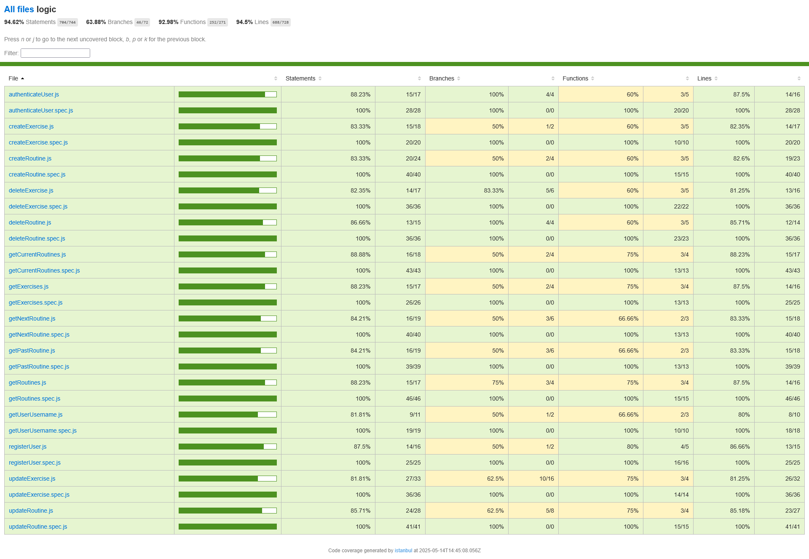

# Fitrack

## Intro

This web application serves to keep track of the routines and exercises you need for your day to day at the gym.

The aim of the project is to provide a small tool to have everything organized and to be able to consult it at any time.

## Functional

### Use Cases

User

- view time resume of routines
- view calendar with routines
- view own routines
- create/delete/edit routines
- create custom/delete/edit custom exercises or edit/delete default exercises
- set a rest timer for every exercises

#### WIP

- edit profile data like password, email ...
- edit body measures (bodyweight, neck, shoulders, chest..)
- search routines,exercises
- view body tracker that displays different body measures

### UIUX Design

[Figma] (https://www.figma.com/design/l5bYaS8vIUDnoayDIWeViE/Project-final?m=auto&t=KPch0LsI4IwDJKWl-1)

## Technical

### Blocks

- App
- API
- Database

### Packages

- app (assets,components, data, logic, view)
- api (data, handler, logic, routes)
- doc
- com (utils, validation)

### Data Model

User

- id (uuid)
- username (string)
- email (string)
- password (string, encrypted)

Routine

- id (uuid)
- user (ObjectId, User.id)
- title (string)
- description (string)
- duration (number)
- difficulty (string enum:easy, medium, hard)
- category (string enum:cardio, strength,...)
- type (String legs, shoulders, upper train)
- exercises([Exercise.id])
- createdAt (Date)
- startDate (Date)
- endDate (Date)

Exercise

- id (uuid)
- user (User.id)
- name (string)
- description (string)
- muscleCategory (string enum: leg, calf, shoulders,chest...)
- instructions (string)
- images ([string])
- videos ([string])
- weight (number)
- sets (number)
- reps (number)
- restTime (number)

#### WIP

BodyTracker

- id (uuid)
- user (ObjectId, User.id)
- date (date)
- weight (number)
- neck (number)
- shoulders (number)
- chest (number)
- legs (number)
- biceps (number)

### Technologies

- React / Vite
- Express / Node
- MongoDB/mongoose
- JWT/bcryptjs
- Mocha/Chai
- React DayPicker/date-fns

### Code Coverage

## Planning

[Issue Tracking](https://github.com/b00tc4mp/isdi-bootcamp-202501/issues/73)
