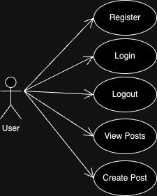
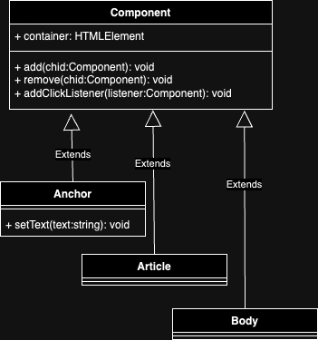
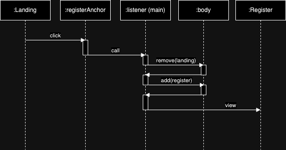

# DEEPSTAGRAM App Product

## Intro

Bootcamp202501

## Functional

### Use Cases

User
- register
- login
- logout
- view posts
- create post
- toggle like post
- delete post
- edit post text

### UIUX Design

[Figma](https://www.figma.com/proto/pIXgvxWA9YhTDjz2WXMiV4/Prueba-app?node-id=4-10&p=f&t=LkWp3hgZufBlEntA-0&scaling=scale-down&content-scaling=fixed&page-id=0%3A1&starting-point-node-id=4%3A10)

## Technical

### Blocks

- App
- ...

### Packages

- app
- ...
- doc (documentation)

### UI Components

### Behaviors

- Navigation from Landing to Register view

### Data Model

User
- id (string, uuid)
- name (string, min length 1, max length 20)
- email (string, max length 30)
- username (string, min length 3, max length 20)
- password (string, min length 8, max length 20)
- createdAt (Date)
- modifiedAt (Date)

Post
- id (string, uuid)
- author (User.id)
- image (string, max length 1000)
- text (string, max length 500)
- createdAt (Date)
- modifiedAt (Date)
- likes ([User.id])

### Technologies

- HTML/CSS/JS
- ...

### Code Coverage

...

## Planning

[Issue Tracking](https://github.com/b00tc4mp/isdi-bootcamp-202501/issues/48)