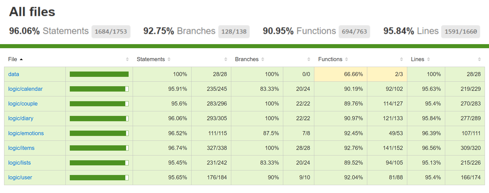

# CoupleApp

## Intro

CoupleApp is an app designed for couples, offering a platform to manage the relationship in a fun and organized way. Features include a shared journal, an event calendar, joint notes, and a days-together counter, all with a cute and cozy design.

## Functional

### Use Cases

User

- link with partner (using a unique code)
- set a starting relationship date
- track the number of days together since the relationship began
- view, add, edit and delete events in a shared calendar
- view, add, edit and delete lists
- view, add, edit and delete the items inside the lists
- view, add, edit and delete diary entries
- select daily one emotion that describe you the most and compare with your partner's emotion

### UI/UX Design

[Figma](https://www.figma.com/design/5LJN7h67e1B4WzjoBDl0Mo/Untitled?node-id=0-1&t=9YfoUVNsJJDSlnOU-1)

## Technical

### Blocks

- App
- API
- DB

### Packages

- app (Frontend: React, Vite, TailwindCSS)
- api (Backend: Express, MongoDB, Mongoose)
- com (validation, errors, constants)
- doc (documentation)

### UI Component tree

- Landing
- Register
- Login
- InviteScreen
- SetDateStart
- Home
  - MainMenu
- Calendar
  - CalendarDayView
  - CalendarEventForm
- Lists
  - ListDetail
- Diary
  - DiaryEntryDetail
- Emotions
  - EmotionsResult

### Data Model

User

- id (string, uuid)
- name (string, min length 1, max length 50)
- email (string, min length 6, max length 40)
- username (string, min length 3, max length 20)
- password (string, hashed, min length 8, max length 72)
- createdAt (Date)
- modifiedAt (Date)

Couple

- id (string, uuid)
- members (array of User.id)
- createdAt (Date)
- modifiedAt (Date)

InviteCode

- id (string, uuid)
- code (string)
- createdAt (Date)
- modifiedAt (Date)

DiaryEntry

- id (string, uuid)
- couple (Couple.id)
- author (User.id)
- text (string, min length 1, max length 2000)
- createdAt (Date)
- modifiedAt (Date)

CalendarEvent

- id (string, uuid)
- couple (Couple.id)
- author (User.id)
- title (string, min length 1, max length 100)
- description (string, min length 1, max length 1000)
- eventDate (Date)
- createdAt (Date)
- modifiedAt (Date)

ListItem

- id (string, uuid)
- text (string, min length 1, max length 500)
- list (List.id)
- createdAt (Date)
- modifiedAt (Date)

List

- id (string, uuid)
- couple (Couple.id)
- author (User.id)
- title (string, min length 1, max length 100)
- items (array of ListItem.id)
- color (string)
- createdAt (Date)
- modifiedAt (Date)

Emotions

- id (string, uuid)
- couple (Couple.id)
- author (User.id)
- emotion (string, max length 50)
- createdAt (Date)
- modifiedAt (Date)

### Technologies

- React / Vite / TailwindCSS
- Express / Node.js
- MongoDB / Mongoose
- Mocha / Chai / C8
- JWT / bcryptjs

### Code Coverage

## Planning

[Issue Tracking](https://github.com/b00tc4mp/isdi-bootcamp-202501/issues/89)
